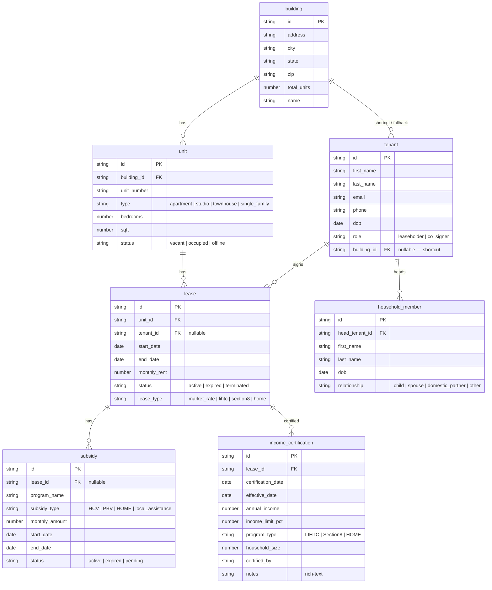

# EHEBCLT CRM — Data Model

This document describes the PocketBase schema backing the CRM. The backend is
PocketBase v0.39.8; all collections and fields are defined via JavaScript
migrations in `backend/pb_migrations/`.

---

## Collections & Fields

### `building` — Physical properties

| Field         | Type        | Required | Notes |
|---------------|-------------|----------|-------|
| `id`          | text (PK)   | yes      | 15-char auto-generated, `^[a-z0-9]+$` |
| `address`     | text        | yes      | |
| `city`        | text        | yes      | `^[a-zA-Z\s]+$` |
| `state`       | text        | yes      | |
| `zip`         | text        | yes      | 5 digits, `^[0-9]{5}$` |
| `total_units` | number      | no       | |
| `name`        | text        | yes      | Added in a later migration |
| `created`     | autodate    | auto     | |
| `updated`     | autodate    | auto     | |

### `unit` — Individual apartments / units within a building

| Field         | Type        | Required | Notes |
|---------------|-------------|----------|-------|
| `id`          | text (PK)   | yes      | |
| `building_id` | relation    | yes      | → `building` |
| `unit_number` | text        | yes      | |
| `type`        | select      | no       | `apartment`, `studio`, `townhouse`, `single_family` |
| `bedrooms`    | number      | no       | |
| `sqft`        | number      | no       | |
| `status`      | select      | no       | `vacant`, `occupied`, `offline` |
| `created`     | autodate    | auto     | |
| `updated`     | autodate    | auto     | |

### `tenant` — Head-of-household residents

| Field         | Type        | Required | Notes |
|---------------|-------------|----------|-------|
| `id`          | text (PK)   | yes      | |
| `first_name`  | text        | yes      | |
| `last_name`   | text        | yes      | |
| `email`       | email       | no       | |
| `phone`       | text        | no       | |
| `dob`         | date        | no       | |
| `role`        | select      | no       | `leaseholder`, `co_signer` |
| `building_id` | relation    | no       | → `building` — **added in a later migration** (see § Asymmetries) |
| `created`     | autodate    | auto     | |
| `updated`     | autodate    | auto     | |

### `lease` — Rental agreements

| Field          | Type        | Required | Notes |
|----------------|-------------|----------|-------|
| `id`           | text (PK)   | yes      | |
| `unit_id`      | relation    | yes      | → `unit` |
| `tenant_id`    | relation    | no       | → `tenant` |
| `start_date`   | date        | yes      | |
| `end_date`     | date        | no       | |
| `monthly_rent` | number      | yes      | |
| `status`       | select      | no       | `active`, `expired`, `terminated` |
| `lease_type`   | select      | no       | `market_rate`, `lihtc`, `section8`, `home` |
| `created`      | autodate    | auto     | |
| `updated`      | autodate    | auto     | |

### `household_member` — Additional people in a tenant's household

| Field            | Type        | Required | Notes |
|------------------|-------------|----------|-------|
| `id`             | text (PK)   | yes      | |
| `head_tenant_id` | relation    | yes      | → `tenant` (the leaseholder / head of household) |
| `first_name`     | text        | yes      | |
| `last_name`      | text        | yes      | |
| `dob`            | date        | no       | |
| `relationship`   | select      | no       | `child`, `spouse`, `domestic_partner`, `other` |
| `created`        | autodate    | auto     | |
| `updated`        | autodate    | auto     | |

### `subsidy` — Subsidy programs attached to leases

| Field            | Type        | Required | Notes |
|------------------|-------------|----------|-------|
| `id`             | text (PK)   | yes      | |
| `lease_id`       | relation    | no       | → `lease` |
| `program_name`   | text        | yes      | |
| `subsidy_type`   | select      | yes      | `HCV`, `PBV`, `HOME`, `local_assistance` |
| `monthly_amount` | number      | no       | |
| `start_date`     | date        | no       | |
| `end_date`       | date        | no       | |
| `status`         | select      | no       | `active`, `expired`, `pending` |
| `created`        | autodate    | auto     | |
| `updated`        | autodate    | auto     | |

### `income_certification` — Income verification records per lease

| Field                | Type        | Required | Notes |
|----------------------|-------------|----------|-------|
| `id`                 | text (PK)   | yes      | |
| `lease_id`           | relation    | yes      | → `lease` |
| `certification_date` | date        | yes      | |
| `effective_date`     | date        | yes      | |
| `annual_income`      | number      | yes      | |
| `income_limit_pct`   | number      | no       | |
| `program_type`       | select      | no       | `LIHTC`, `Section8`, `HOME` |
| `household_size`     | number      | no       | |
| `certified_by`       | text        | no       | |
| `notes`              | editor      | no       | Rich-text |
| `created`            | autodate    | auto     | |
| `updated`            | autodate    | auto     | |

### `_audits` — Automatic audit log

| Field             | Type        | Required | Notes |
|-------------------|-------------|----------|-------|
| `id`              | text (PK)   | yes      | |
| `action`          | select      | yes      | `create`, `update`, `delete` |
| `collection_name` | text        | yes      | |
| `record_id`       | text        | no       | |
| `changes`         | json        | no       | For updates: `{field: {old, new}}`; for creates/deletes: flat key-values |
| `actor_email`     | text        | no       | |
| `actor_id`        | text        | no       | |
| `created_at`      | date        | no       | |

Managed by the hook at `backend/pb_hooks/audit_log.pb.js`. A daily cron
(`backend/pb_hooks/cron.pb.js`) purges records older than the configured
retention window. Collections whose names start with `_` are excluded from
auditing.

### `users` — Built-in PocketBase auth

Standard PocketBase `_pb_users_auth_` collection. Public self-registration is
disabled (`createRule: null`); only admins can create user accounts.

---

## Relationships

```
building 1 ──── * unit            (unit.building_id)
building 1 ──── * tenant          (tenant.building_id — shortcut / fallback)
tenant   1 ──── * lease           (lease.tenant_id — nullable)
unit     1 ──── * lease           (lease.unit_id)
tenant   1 ──── * household_member (household_member.head_tenant_id)
lease    1 ──── * subsidy         (subsidy.lease_id — nullable)
lease    1 ──── * income_certification (income_certification.lease_id)
```

---

## Entity-Relationship Diagram



---

## Asymmetries & Unusual Patterns

### Two paths to the same data: `tenant → building`

There are **two ways** to find which building a tenant lives in:

1. **Primary / normalized path:**
   `tenant → lease → unit → building`
   The tenant signs a lease, the lease is for a unit, and the unit belongs to
   a building.

2. **Direct shortcut (fallback):**
   `tenant.building_id → building`
   Added later in migration `1787191717_updated_tenant.js` as an optional,
   direct relation from tenant to building.

The frontend (`ResidentsTab.jsx:86`) resolves the building by preferring the
lease path and falling back to the shortcut:

```js
const building = unit?.expand?.building_id || t.expand?.building_id || null;
```

**Rationale:** A tenant may be registered in the system before a lease record
exists (or their lease may have expired), yet the staff still needs to know
what building they're associated with. The shortcut avoids the N+1 join chain
and handles the "tenant without an active lease" case gracefully.

### Nullable foreign keys

| Field             | Why it's nullable |
|-------------------|--------------------|
| `lease.tenant_id` | A unit may have a lease record without a named tenant yet (administrative placeholder). |
| `subsidy.lease_id` | A subsidy might be tracked independently before being attached to a specific lease. |
| `tenant.building_id` | The shortcut field is optional — the normalized path via lease/unit is the canonical one. |

### `tenant.role` is defined but not fully wired

The `tenant.role` field (`leaseholder` / `co_signer`) describes the tenant's
role on a *lease*, but it lives directly on the tenant record rather than on
the lease itself. If a tenant co-signs one lease and is leaseholder on another,
this single-valued field cannot capture that nuance. In practice the field
defaults to `leaseholder` and the frontend uses it as a label without enforcing
multi-lease semantics.

### Deleted `tenants` collection

An earlier `tenants` collection (flat schema: tenant name + move-in date +
lease status + annual income + unit number all in one table) was replaced
during the initial schema design by the normalized `tenant` / `lease` / `unit`
model. Migration `1783211360_deleted_tenants.js` removed it.

### No `household` container

A tenant heads a household, and `household_member` records point to the tenant
via `head_tenant_id`. There is no separate `household` collection — the
household is implicitly the set of household-member records linked to a given
tenant.